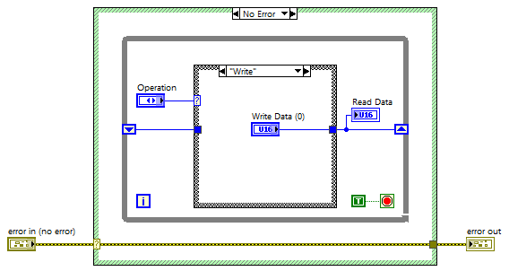

#LabVIEW #FGV
Eine funktionale globale Variable (FGV) ist ein häufig verwendetes Entwurfsmuster. Eine FGV ist ein nicht ablaufendes VI mit einer while-Schleife, die einmal durchläuft und über ein nicht initialisiertes Schieberegister verfügt. Der Zweck dieser Konstruktion besteht darin, Daten zwischen aufeinanderfolgenden Aufrufen der FGV zu speichern.

Verwende eine funktionale globale Variable (FGV), um zwischen zwei parallelen Prozessschleifen zu kommunizieren, die in verschiedenen VIs unter demselben Ziel enthalten sind, und verwende eine FGV, um parallele Schleifen mit einer "Stopp"-Schaltfläche anzuhalten. Die "funktionale" Natur der FGV bedeutet, dass Du zusätzliche Funktionen erstellen kannst, die über die einer einfachen globalen Variablen hinausgehen, z. B. Zählungen und Berechnungen, die mit dem gespeicherten Wert arbeiten.

# Anwendungsfälle

- Kommunikation von Daten, Steuerung und Status zwischen zwei oder mehr parallelen Prozessschleifen innerhalb desselben Ziels ("target-scoped"), entweder im selben VI oder in verschiedenen VIs 
- Bereitstellung des letzten Wertes einer Variablen für andere Prozessschleifen 
- Anhalten mehrerer paralleler Schleifen durch eine einzige Steuerung 
- Durchführung zusätzlicher Operationen (der "funktionale" Aspekt des FGV-Akronyms), die über die bloße Speicherung der Daten hinausgehen, z. B. Zählen und Berechnen
# Eigenschaften

- Eine funktionale globale Variable ist eine SubVI mit diesen definierenden Merkmalen:
	- Nicht initialisiertes Schieberegister: Ein nicht initialisiertes Schieberegister in einer while-Schleife führt dazu, dass LabVIEW Speicher für einen einzelnen Wert zuweist, der so lange bestehen bleibt, wie das aufrufende VI im Speicher verbleibt.
	- Einfacher Durchlauf der while-Schleife - der bedingte Anschluss der while-Schleife ist mit einer "true"-Konstante verdrahtet und wird daher nur einmal durchlaufen; die while-Schleife ist lediglich ein Mechanismus zum Halten des Schieberegisters
	- Case-Struktur mit Aufzählungssteuerung - die Case-Struktur wählt eine Operation aus, die mit dem gespeicherten Wert durchgeführt werden soll; "Lesen" und "Schreiben" sind die grundlegendsten Operationen, und zusätzliche Cases können zusätzliche Funktionen wie "Inkrement", "Dekrement" usw. implementieren.
	- Nicht abtrünniges SubVI - dieser Ausführungsmodus stellt sicher, dass nur eine Instanz des SubVIs im Ziel existiert; mehrere Instanzen des SubVIs verweisen alle auf denselben gespeicherten Wert
- Funktionale globale Variablen bieten zwei Vorteile gegenüber lokalen Variablen und globalen Variablen:
	- Speichereffizienz - der gespeicherte Wert existiert nur an einer Stelle im Speicher, während jede Instanz eines lokalen/globalen Variablenlesers eine eigene Kopie der Daten erstellt
	- Vermeidung von Wettlaufsituationen - der gespeicherte Wert kann nicht geschrieben werden, während er gelesen wird, da das SubVI nur von einem Prozess gleichzeitig ausgeführt werden kann
# Bitte beachte

- Der SubVI-Ausführungsmodus muss auf "nicht ablaufend" eingestellt sein (öffnen Sie das SubVI, drücken Sie Strg+I, wählen Sie die Kategorie "Ausführung" und wählen Sie "nicht ablaufende Ausführung"); die beiden anderen ablaufenden Ausführungsmodi erstellen unabhängige Kopien ("Klone") des SubVIs, wodurch der globale Variablenaspekt der FGV entfällt
